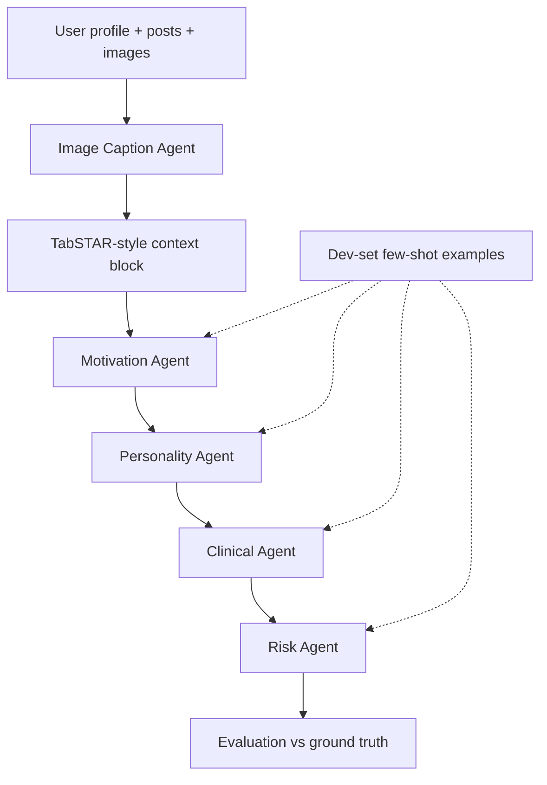

# SSRisk: Agentic Suicide Risk Detection Pipeline

A multi-agent LLM pipeline that modernizes the hierarchical suicide-risk prediction framework from **Ophir et al. (2020)** using contemporary language models instead of deep neural networks.

> **Disclaimer:** This project is for **research and educational purposes only**. It is **not** a clinical diagnostic tool. If you or someone you know is in crisis, contact local emergency services or a suicide prevention hotline (e.g., **988 Suicide & Crisis Lifeline** in the US).

## Overview

The original study ([Scientific Reports, 2020](https://doi.org/10.1038/s41598-020-73917-0)) predicted suicide risk from Facebook posts using a Multi-Task Model (MTM):

```
Facebook text → Personality → Psychosocial distress → Psychiatric disorders → Suicide (C-SSRS)
```

This repository replaces the MTM with a **chain of LLM agents**, inspired by [TabSTAR](https://arxiv.org/abs/2505.18125) text serialization:

1. **Image Caption Agent** – describes attached images in natural language
2. **Motivation Agent** – classifies social-media motivation + FOMO score
3. **Personality Agent** – Big Five traits + loneliness, brooding, worry, life satisfaction
4. **Clinical Agent** – PHQ-9 items + MDD diagnosis
5. **Risk Agent** – CSSRS suicide severity (0–6)

Each agent receives the accumulated context from prior agents plus few-shot examples from a dev set.

## Architecture



## Quick Start

### 1. Install

```bash
cd nlpproject
python -m venv .venv
.venv\Scripts\activate        # Windows
pip install -r requirements.txt
pip install -e .
```

### 2. Run (offline mock mode – no API key needed)

```bash
python -m ssrisk all
```

This will:
- Generate synthetic data (`data/synthetic_users.csv`, `data/posts.json`)
- Run the full agent pipeline in **mock mode**
- Write results to `outputs/pipeline_results.csv`
- Produce `outputs/evaluation_report.json`

### 3. Use OpenAI (recommended for real runs)

```bash
copy .env.example .env
# Set LLM_PROVIDER=openai and OPENAI_API_KEY=sk-...
```

Edit `config.yaml`:

```yaml
llm:
  provider: openai
  model: gpt-4o
```

Then run:

```bash
python -m ssrisk run
python -m ssrisk evaluate
```

### CLI Commands

| Command | Description |
|---------|-------------|
| `python -m ssrisk generate-data` | Create synthetic dataset |
| `python -m ssrisk run` | Execute agent pipeline |
| `python -m ssrisk evaluate` | Compute metrics from results |
| `python -m ssrisk all` | Generate + run + evaluate |

## Project Structure

```
src/ssrisk/
├── agents/          # Image caption, motivation, personality, clinical, risk
├── data/            # Schema, synthetic generator, loader, serializer
├── llm/             # Mock, OpenAI, Anthropic, Ollama clients
├── prompts/         # System prompts and few-shot templates
├── pipeline.py      # Orchestration
├── evaluation.py    # AUC, Cohen's d, F1, Pearson, MAE
└── cli.py           # Entry point
resources/           # Original papers, data dictionary, skeleton code
tests/               # Unit and smoke tests
```

## Swapping in Real Data

Replace synthetic files with your real dataset matching the schema in `resources/features_exp.xlsx`:

1. **`data/synthetic_users.csv`** – one row per user with columns: `UserId`, `status_posts`, `grp`, `SD`, `MDD`, `FOMO`, `BFI_N`, `Lonely`, `PHQ9_*`, etc.
2. **`data/posts.json`** – keyed by `UserId`:

```json
{
  "U0001": [
    {
      "post_id": "p1",
      "text": "Post content...",
      "date": "2024-03-15",
      "images": [{"image_id": "img1", "hint": "optional description"}]
    }
  ]
}
```

Inclusion criteria (matching the paper): `status_posts > 9`, `grp in [0, 1]`.

Update paths in `config.yaml` if needed.

## LLM Providers

| Provider | Env variable | Notes |
|----------|-------------|-------|
| `mock` (default) | none | Deterministic heuristics, no API cost |
| `openai` | `OPENAI_API_KEY` | Structured outputs via GPT-4o |
| `anthropic` | `ANTHROPIC_API_KEY` | Requires `pip install anthropic` |
| `ollama` | local server | Requires Ollama running locally |

Set `LLM_PROVIDER` in `.env` or `llm.provider` in `config.yaml`.

## Evaluation Metrics

Mirroring the original paper:
- **AUC-ROC** and **Cohen's d** for binary suicide risk (SD ≥ 1)
- **F1 / accuracy** for MDD classification
- **Pearson r / MAE** for continuous scales (FOMO, loneliness, etc.)

## Ethics & Limitations

- Runs on **synthetic data** by default; results do not reflect real-world clinical performance.
- Social media language is ambiguous; predictions must not be used for individual-level decisions.
- The original dataset is not publicly available due to participant privacy (Ophir et al., 2020).
- Image captioning uses text hints in mock mode; real vision models should be used with actual image pixels.

## References

1. Ophir, Y., Tikochinski, R., Asterhan, C. S. C., Sisso, I., & Reichart, R. (2020). Deep neural networks detect suicide risk from textual facebook posts. *Scientific Reports*, 10, 16685.
2. Arazi, A., Shapira, E., & Reichart, R. (2025). TabSTAR: A Tabular Foundation Model for Tabular Data with Text Fields. *NeurIPS 2025*.
3. Badian, Y., Ophir, Y., Tikochinski, R., Calderon, N., Klomek, A. B., & Reichart, R. (2023). A Picture May Be Worth a Thousand Lives: Predictions of Suicide Risk from Social Media Images.

## License

Research/educational use. See original publications for data access terms.
