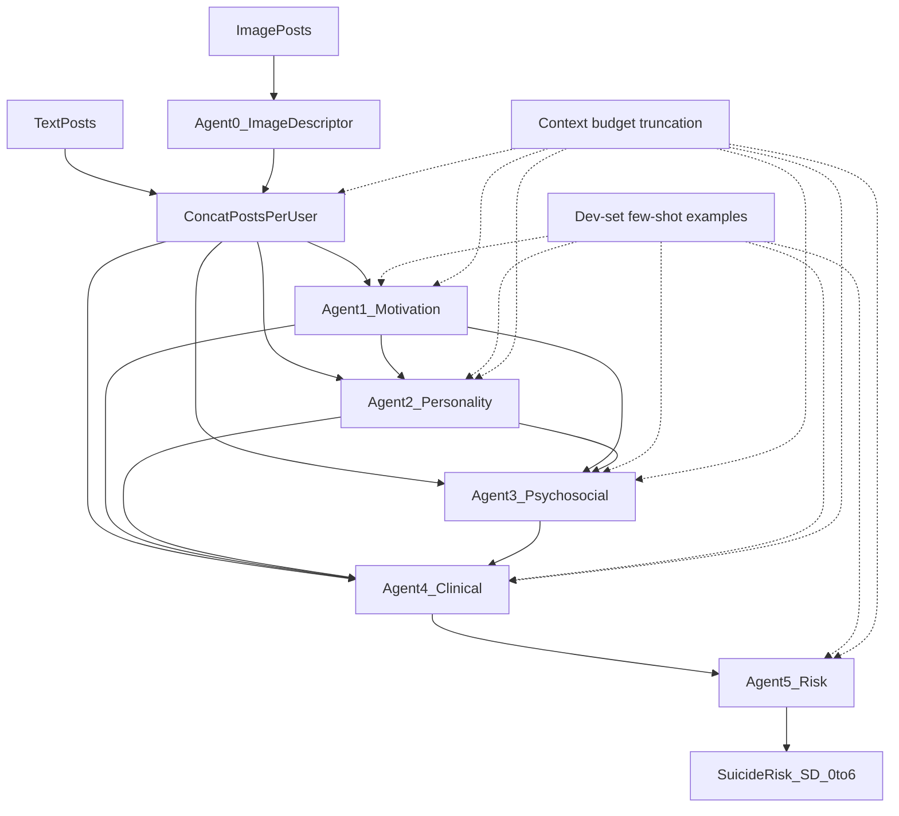

# SSRisk: Agentic Suicide Risk Detection Pipeline

A multi-agent LLM pipeline that modernizes the hierarchical suicide-risk prediction framework from **Ophir et al. (2020)** using contemporary language models instead of deep neural networks.

> **Disclaimer:** This project is for **research and educational purposes only**. It is **not** a clinical diagnostic tool. If you or someone you know is in crisis, contact local emergency services or a suicide prevention hotline (e.g., **988 Suicide & Crisis Lifeline** in the US).

## Overview

The original study ([Scientific Reports, 2020](https://doi.org/10.1038/s41598-020-73917-0)) predicted suicide risk from Facebook posts using a Multi-Task Model (MTM):

```
Facebook text → Personality → Psychosocial distress → Psychiatric disorders → Suicide (C-SSRS)
```

This repository replaces the MTM with a **chain of specialized LLM agents**:

1. **Image Caption Agent (0)** – describes attached images in natural language
2. **Motivation Agent (1)** – classifies social-media motivation + FOMO score
3. **Personality Agent (2)** – Big Five traits
4. **Psychosocial Agent (3)** – loneliness, brooding, worry, life satisfaction
5. **Clinical Agent (4)** – PHQ-9 items + MDD diagnosis
6. **Risk Agent (5)** – C-SSRS suicide severity (0–6) from the full accumulated clinical file

Each agent receives accumulated context from prior agents plus few-shot examples from a dev set. Context is automatically truncated to stay within configured token budgets.

## Architecture


```mermaid
flowchart TD
    textPosts[TextPosts] --> concat[ConcatPostsPerUser]
    imagePosts[ImagePosts] --> agent0[Agent0_ImageDescriptor]
    agent0 --> concat
    concat --> agent1[Agent1_Motivation]
    concat --> agent2[Agent2_Personality]
    concat --> agent3[Agent3_Psychosocial]
    concat --> agent4[Agent4_Clinical]
    agent1 --> agent2
    agent1 --> agent3
    agent1 --> agent4
    agent2 --> agent3
    agent2 --> agent4
    agent3 --> agent4
    agent4 --> agent5[Agent5_Risk]
    agent5 --> suicideRisk[SuicideRisk_SD_0to6]
    fewshot[Dev-set few-shot examples] -.-> agent1 & agent2 & agent3 & agent4 & agent5
    contextBudget[Context budget truncation] -.-> concat & agent1 & agent2 & agent3 & agent4 & agent5
```

## Quick Start

### 1. Install

```bash
cd nlp_proj
python -m venv .venv
source .venv/bin/activate   # Linux/macOS
pip install -r requirements.txt
pip install -e .
```

### 2. Run (offline mock mode – no API key needed)

Agents 0–5 run in **mock mode**; suicide severity is predicted by the Risk Agent.

```bash
python -m ssrisk all
```

This will:
- Generate synthetic data (`data/synthetic_users.csv`, `data/posts.json`)
- Run agents 0–5 in **mock mode**, predict C-SSRS severity on test users
- Write results to `outputs/pipeline_results.csv`
- Produce `outputs/evaluation_report.json`

### 3. Use Ollama (local LLM)

Ensure Ollama is running, then set in `config.yaml`:

```yaml
llm:
  provider: ollama
  model: llama3.1
```

Run:

```bash
python -m ssrisk run
python -m ssrisk evaluate
```

### CLI Commands

| Command | Description |
|---------|-------------|
| `python -m ssrisk generate-data` | Create synthetic dataset |
| `python -m ssrisk run` | Execute agent pipeline |
| `python -m ssrisk evaluate` | Compute metrics from results |
| `python -m ssrisk all` | Generate + run + evaluate |
| `python -m ssrisk finetune export` | Export per-agent SFT JSONL from dev set |
| `python -m ssrisk finetune modelfiles` | Generate Ollama Modelfiles per agent |

## Project Structure

```
src/ssrisk/
├── agents/          # Image caption, motivation, personality, psychosocial, clinical, risk
├── context/         # Token budget estimation and prompt truncation
├── data/            # Schema, synthetic generator, loader, serializer, chain
├── finetune/        # SFT dataset export and Modelfile generation
├── llm/             # Mock, OpenAI, Anthropic, Ollama clients + per-agent factory
├── prompts/         # System prompts and few-shot templates
├── pipeline.py      # Orchestration (multi-agent chain)
├── evaluation.py    # AUC, Cohen's d, F1, Pearson, MAE
└── cli.py           # Entry point
resources/           # Original papers, data dictionary
tests/               # Unit tests
```

## Per-Agent Ollama Configuration

Each agent can use a different fine-tuned Ollama model:

```yaml
agents:
  image_caption:
    model: llama3.1
    temperature: 0.1
  motivation:
    model: ssrisk-motivation   # after fine-tuning
  personality: {}
  psychosocial: {}
  clinical: {}
  risk: {}
```

Unset fields fall back to global `llm.model` and `llm.temperature`.

## Fine-Tuning Ollama Agents

1. **Export SFT datasets** from the dev split (teacher-forced prior-agent outputs):

```bash
python -m ssrisk finetune export
```

Writes `outputs/finetune/{agent}.jsonl` with `system`, `user`, and `assistant` fields.

2. **Train externally** (e.g., Axolotl, Unsloth, or LoRA on the JSONL), convert to GGUF if needed.

3. **Generate Modelfiles** with baked-in system prompts:

```bash
python -m ssrisk finetune modelfiles
```

Creates `outputs/modelfiles/{agent}.Modelfile` and prints `ollama create` commands.

4. **Point config** at your specialized models via `agents.<name>.model`.

## Context Length Management

Long post histories and accumulated agent outputs are truncated to prevent context overflow:

```yaml
context:
  max_input_tokens: 8192
  reserve_output_tokens: 1024
  truncation_strategy: tail_posts   # drop oldest posts first
  max_few_shot_tokens: 1500
  max_agent_output_tokens: 800
```

Also set `data.max_posts_per_user` to cap posts at load time.

## Swapping in Real Data

Replace synthetic files with your real dataset matching the schema in `resources/features_exp.xlsx`:

1. **`data/synthetic_users.csv`** – one row per user with columns: `UserId`, `status_posts`, `grp`, `SD`, `MDD`, `FOMO`, `BFI_N`, `Lonely`, `PHQ9_*`, etc.
2. **`data/posts.json`** – keyed by `UserId`:

```json
{
  "U0001": [
    {
      "post_id": "p1",
      "text": "Post content...",
      "date": "2024-03-15",
      "images": [{"image_id": "img1", "hint": "optional description"}]
    }
  ]
}
```

Inclusion criteria (matching the paper): `status_posts > 9`, `grp in [0, 1]`.

Update paths in `config.yaml` if needed.

## LLM Providers

| Provider | Env variable | Notes |
|----------|-------------|-------|
| `mock` (default) | none | Deterministic heuristics, no API cost |
| `openai` | `OPENAI_API_KEY` | Structured outputs via GPT-4o |
| `anthropic` | `ANTHROPIC_API_KEY` | Requires `pip install anthropic` |
| `ollama` | local server | Requires Ollama running locally |

Set `LLM_PROVIDER` in `.env` or `llm.provider` in `config.yaml`.

## Evaluation Metrics

- **AUC-ROC** and **Cohen's d** for binary suicide risk: **SD 0–4 = negative**, **SD 5–6 = positive**
- **F1 / accuracy** for MDD classification
- **Pearson r / MAE** for continuous scales (FOMO, loneliness, etc.)

Configure the binary split in `config.yaml`:

```yaml
evaluation:
  binary_sd_positive_min: 5
```

## Ethics & Limitations

- Runs on **synthetic data** by default; results do not reflect real-world clinical performance.
- Social media language is ambiguous; predictions must not be used for individual-level decisions.
- The original dataset is not publicly available due to participant privacy (Ophir et al., 2020).
- Image captioning uses text hints in mock mode; real vision models should be used with actual image pixels.

## References

1. Ophir, Y., Tikochinski, R., Asterhan, C. S. C., Sisso, I., & Reichart, R. (2020). Deep neural networks detect suicide risk from textual facebook posts. *Scientific Reports*, 10, 16685.
2. Badian, Y., Ophir, Y., Tikochinski, R., Calderon, N., Klomek, A. B., & Reichart, R. (2023). A Picture May Be Worth a Thousand Lives: Predictions of Suicide Risk from Social Media Images.

## License

Research/educational use. See original publications for data access terms.
